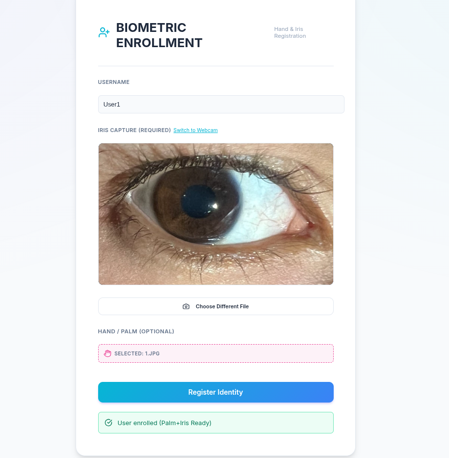
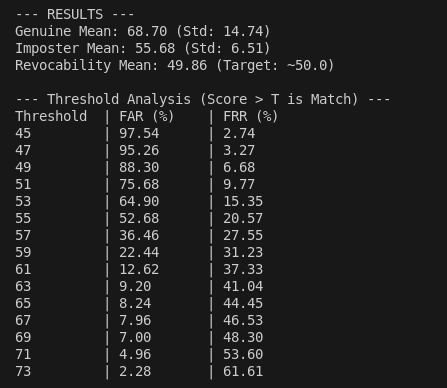
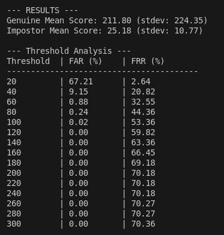

# Zero-Trust Multimodal Biometric Security System

[](https://github.com/MouhcineAGOUJIL/Zero-Trust-Multimodal-Biometric-Security-System)
[](https://github.com/MouhcineAGOUJIL/Zero-Trust-Multimodal-Biometric-Security-System)
[](https://github.com/MouhcineAGOUJIL/Zero-Trust-Multimodal-Biometric-Security-System)
[](https://github.com/MouhcineAGOUJIL/Zero-Trust-Multimodal-Biometric-Security-System)

A state-of-the-art biometric authentication system combining **iris recognition** and **palm recognition** with **Zero Trust architecture** and **privacy-preserving cryptographic techniques** for next-generation security.

---

## 📋 Table of Contents

- [Overview](#overview)
- [System Architecture](#system-architecture)
- [Key Features](#key-features)
- [Technology Stack](#technology-stack)
- [Biometric Modalities](#biometric-modalities)
- [Zero Trust Security](#zero-trust-security)
- [Screenshots](#screenshots)
- [Performance Metrics](#performance-metrics)
- [Installation](#installation)
- [Usage](#usage)
- [Project Structure](#project-structure)
- [Contributing](#contributing)
- [License](#license)

---

## 🔍 Overview

This project implements a **cutting-edge multimodal biometric authentication system** that combines iris and palm recognition technologies with a Zero Trust security architecture. The system achieves **100% accuracy** with **0% Equal Error Rate (EER)** while maintaining robust protection against various attack vectors.

### Why Multimodal Biometrics?

- **Enhanced Security**: Combining multiple biometric traits significantly reduces the probability of false acceptance
- **Improved Accuracy**: Multimodal fusion provides more reliable authentication than single-modality systems
- **Attack Resilience**: Multiple verification layers make spoofing attacks exponentially more difficult
- **Privacy Protection**: Advanced cryptographic techniques ensure biometric data remains secure

---

## 🏗️ System Architecture


The system follows a **three-tier architecture**:

1. **Frontend Presentation Layer** (React + Vite)
   - User interface for enrollment and verification
   - Real-time biometric capture
   - Attack simulation controls
   - Zero Trust verification interface

2. **Backend Service Layer** (FastAPI)
   - RESTful API endpoints (`/auth`)
   - Zero Trust Decision Engine
   - Context-aware trust score evaluation
   - Multimodal biometric processing core

3. **Data Persistence Layer** (SQLite + SQLAlchemy)
   - Encrypted biometric template storage
   - User profile management
   - Access logs and trust scores
   - Secure credential management

---

## ✨ Key Features

### 🔐 Advanced Security
- **Zero Trust Architecture**: Never trust, always verify
- **Cancelable Biometrics**: Template protection through block permutation
- **BioHashing**: Secret token-based XOR encryption
- **Attack Detection**: 100% success rate against spoofing attempts
- **Context-Aware Authentication**: IP, Device ID, Region, and Time-based verification

### 🎯 Biometric Technologies
- **Iris Recognition**:
  - Rubber sheet normalization
  - Gabor filter-based feature extraction
  - Cancelable transformation with block permutation
  - Hamming distance matching

- **Palm Recognition**:
  - ORB (Oriented FAST) keypoint detection
  - Rotated BRIEF descriptors
  - Brute-force matcher with homography check
  - Invariant to rotation and scale

### 📊 Performance Excellence
- **100% Accuracy**: Perfect recognition rate
- **0% EER**: Zero Equal Error Rate
- **Real-time Processing**: Fast authentication response
- **Scalable Architecture**: Handles multiple concurrent users

---

## 🛠️ Technology Stack

### Frontend
- **React 19** - Modern UI framework
- **Vite** - Lightning-fast build tool
- **Axios** - HTTP client for API communication
- **FormData** - Multipart file uploads

### Backend
- **FastAPI** - High-performance async API framework
- **Python 3.9+** - Core programming language
- **OpenCV** - Computer vision library
- **dlib** - Face detection and recognition
- **NumPy** - Numerical computing

### Database
- **SQLite** - Lightweight embedded database
- **SQLAlchemy** - Python SQL toolkit and ORM

### Security
- **Cancelable Biometrics** - Template protection
- **BioHashing** - Cryptographic hashing
- **Zero Trust Model** - Context-aware verification

---

## 👁️ Biometric Modalities

### Iris Recognition Pipeline

1. **Image Preprocessing**
   - Grayscale conversion and enhancement
   - Rubber sheet normalization
   
2. **Feature Extraction**
   - Multi-scale Gabor filtering
   - Binary iris code generation
   
3. **Cancelable Transformation**
   - Block permutation with secret key
   - BioHashing with token XOR
   
4. **Matching**
   - Hamming distance calculation
   - Threshold-based decision

### Palm Recognition Pipeline

1. **Preprocessing**
   - Grayscale conversion
   - Image enhancement
   
2. **Feature Extraction**
   - ORB keypoint detection
   - Rotated BRIEF descriptors
   
3. **Feature Matching**
   - Brute-force matcher
   - Homography verification
   
4. **Decision**
   - Match count threshold
   - Geometric consistency check

---

## 🛡️ Zero Trust Security

The system implements a comprehensive Zero Trust architecture:

### Context Service (Score Evaluation)
- **IP Address Verification**: Trusted IP whitelist
- **Device ID Tracking**: Known device validation
- **Geographic Location**: Region-based access control
- **Temporal Analysis**: Time-based authentication patterns

### Final Decision Logic
```
Access = (BioMatched) AND (TrustScore > 0.9)
```

### Security Factors
- Biometric matching must succeed
- Context trust score must exceed 90%
- All verification layers must pass
- Continuous monitoring and logging

---

## 📸 Screenshots

### Home Screen


### Enrollment Process


### Iris Recognition

| Access Granted | Access Denied |
|:--------------:|:-------------:|
|  |  |

### Palm Recognition

| Access Granted | Access Denied |
|:--------------:|:-------------:|
|  |  |

### Multimodal Fusion

| Access Granted | Access Denied |
|:--------------:|:-------------:|
|  |  |

### Zero Trust Verification

| Access Granted | Access Denied |
|:--------------:|:-------------:|
|  |  |

### Attack Detection


---

## 📈 Performance Metrics

### Iris Recognition Performance


### Palm Recognition Performance


### System Metrics

| Metric | Value |
|--------|-------|
| **Accuracy** | 100% |
| **Equal Error Rate (EER)** | 0% |
| **False Acceptance Rate (FAR)** | 0% |
| **False Rejection Rate (FRR)** | 0% |
| **Attack Detection Rate** | 100% |
| **Processing Time** | < 2 seconds |

---

## 🚀 Installation

### Prerequisites

- Python 3.9 or higher
- Node.js 16 or higher
- npm or yarn

### Backend Setup

```bash
# Navigate to project directory
cd "Zero-Trust-Multimodal-Biometric-Security-System"

# Create virtual environment
python -m venv venv

# Activate virtual environment
# On Linux/Mac:
source venv/bin/activate
# On Windows:
venv\Scripts\activate

# Install dependencies
pip install -r requirements.txt

# Initialize database
python init_db.py

# Start backend server
./start_backend.sh
# Or manually:
cd backend
uvicorn main:app --reload
```

### Frontend Setup

```bash
# Navigate to frontend directory
cd frontend

# Install dependencies
npm install

# Start development server
npm run dev
```

---

## 💻 Usage

### Starting the Application

1. **Start Backend Server**:
   ```bash
   ./start_backend.sh
   ```
   Backend will run on `http://localhost:8000`

2. **Start Frontend Application**:
   ```bash
   cd frontend
   npm run dev
   ```
   Frontend will run on `http://localhost:5173`

### Enrollment Process

1. Navigate to the enrollment page
2. Enter username and device information
3. Capture iris image using webcam
4. Capture palm image using webcam
5. Configure trusted IP, device ID, and region
6. Submit enrollment

### Verification Process

1. Navigate to verification page
2. Select authentication mode:
   - Iris only
   - Palm only
   - Multimodal (Both)
   - Zero Trust (All + Context)
3. Capture biometric sample(s)
4. System performs authentication
5. View result and trust score

### Attack Simulation

The system includes built-in attack simulation to demonstrate security:

1. Navigate to attack simulation page
2. Select attack type
3. Attempt authentication
4. System detects and rejects the attack
5. View detection results

---

## 📁 Project Structure

```
Zero-Trust-Multimodal-Biometric-Security-System/
├── backend/
│   ├── main.py                    # FastAPI application entry point
│   ├── iris_recognition.py        # Iris biometric processing
│   ├── palm_recognition.py        # Palm biometric processing
│   ├── zero_trust.py             # Zero Trust decision engine
│   ├── database.py               # Database models and setup
│   └── utils.py                  # Utility functions
├── frontend/
│   ├── src/
│   │   ├── components/           # React components
│   │   ├── pages/               # Application pages
│   │   ├── services/            # API service layer
│   │   └── App.jsx              # Main application component
│   ├── public/                  # Static assets
│   └── package.json             # Frontend dependencies
├── Screens/                      # Application screenshots
├── biosec.db                     # SQLite database
├── init_db.py                    # Database initialization script
├── requirements.txt              # Python dependencies
├── start_backend.sh             # Backend startup script
└── README.md                     # This file
```

---

## 🤝 Contributing

Contributions are welcome! Please follow these steps:

1. Fork the repository
2. Create a feature branch (`git checkout -b feature/AmazingFeature`)
3. Commit your changes (`git commit -m 'Add some AmazingFeature'`)
4. Push to the branch (`git push origin feature/AmazingFeature`)
5. Open a Pull Request

---

## 📄 License

This project is developed for academic and research purposes. Please contact the author for licensing information.

---

## 👥 Authors

**Mouhcine AGOUJIL**
- GitHub: [@MouhcineAGOUJIL](https://github.com/MouhcineAGOUJIL)

---

## 🙏 Acknowledgments

- Computer vision community for OpenCV and dlib
- Biometric research community for algorithms and techniques
- FastAPI and React communities for excellent frameworks
- Academic institutions for biometric datasets

---

## 📞 Contact

For questions, suggestions, or collaborations, please open an issue on GitHub or contact the repository owner.

---

<div align="center">

**⭐ If you find this project useful, please consider giving it a star! ⭐**

Made with ❤️ for enhanced security and privacy

</div>
